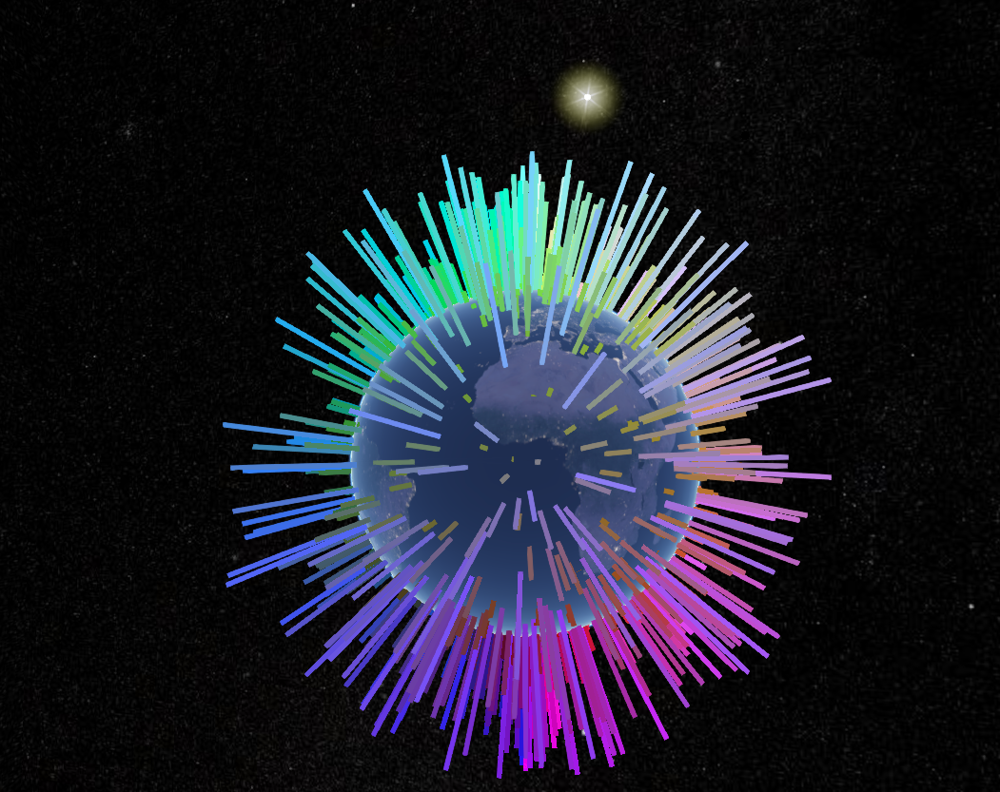

[](https://travis-ci.com/LonnyGomes/hexbot)

# 👋 Meet My Hexbot

A different color with every ping.

Every request returns a different hex code. From #000000 to #FFFFFF—and all 16,777,216 colors between—you can do anything you want with the data.

My HexBot implementation interpolates a RGB value to a longitude (RED), latitude (GREEN), and altitude (BLUE) coordinate and plots the results on a 3D globe using [Cesium JS](https://cesiumjs.org/index.html).

### 3D Globe Perspective



### 2.5D Map Perspective


## Altitude calculation

The altitude is based on distance to the [exosphere](https://en.wikipedia.org/wiki/Atmosphere_of_Earth) in meters (EXOSPHERE_IN_METERS).

## Color ➡️ latitude/longitude conversion

The longitude and latitude is computed by taking the values (0-255) of the red (longitude) and green (latitude) channels and assigning a corresponding geographic coordinate as demonstrated in the table below.

| Color   | Longitude | Latitude | Altitude                |
| ------- | --------- | -------- | ----------------------- |
| #000000 | -180      | -90      | 0                       |
| #7F7F7F | ~0        | ~0       | EXOSPHERE_IN_METERS / 2 |
| #FFFFFF | 180       | 90       | EXOSPHERE_IN_METERS     |

## 🤖 API basics

There's a single endpoint: `api.noopschallenge.com/hexbot`

The endpoint accepts four parameters, all optional:

-   **count** _(optional, numeric)_: Between 1 and 1,000. Number of colors to return.
-   **width** _(optional, numeric)_: Between 10 and 100,000. Maximum width of returned points.
-   **height** _(optional, numeric)_: Between 10 and 100,000. Maximum height of returned points.
-   **seed** _(optional, string)_: Comma separated list of hex codes, up to 10. Note that hex codes should not have the `#`. Returned colors will be a mix of a random combination of two of the seeds. If you submit an invalid hex code, you'll receive an error instead of more beautiful colors.

The endpoint returns a JSON object with an array named `colors` of _n_ length.

Each item in the `colors` array is an object with the property `value` and, optionally, a `coordinates` object that has `x` and `y` properties.

Example return for five colors:

`GET /hexbot?count=5`

```
{
  "colors": [
    {"value": "#EF7FED"},
    {"value": "#5F47C2"},
    {"value": "#D5FF9F"},
    {"value": "#62B217"},
    {"value": "#DD36D9"}
  ]
}
```

Example return for five colors with coordinates:

`GET /hexbot?count=5&width=1000&height=1000`

```
{
  "colors":[
    {
      "value":"#2E84C5",
      "coordinates":{"x":755,"y":331}
    },
    {
      "value":"#116BAA",
      "coordinates":{"x":52,"y":998}
    },
    {
      "value":"#C742B2",
      "coordinates":{"x":617,"y":478}
    },
    {
      "value":"#4C2BB9",
      "coordinates":{"x":13,"y":183}
    },
    {
      "value":"#0C98FB",
      "coordinates":{"x":604,"y":507}
    }
  ]
}
```

Example of seeding colors with a comma delimited string of hex codes:

`GET /hexbot?count=5&seed=FF7F50,FFD700,FF8C00`

```
{
  "colors": [
    { "value": "#FF983A" },
    { "value": "#FF7F50" },
    { "value": "#FF7F50" },
    { "value": "#FFAB28" },
    { "value": "#FFBA1A" }
  ]
}
```

Complete [API documentation](./API.md).

## Testing

Unit tests are written in [Jest](https://jestjs.io/en/) and can be run with the following command:

```bash
npm test
```
